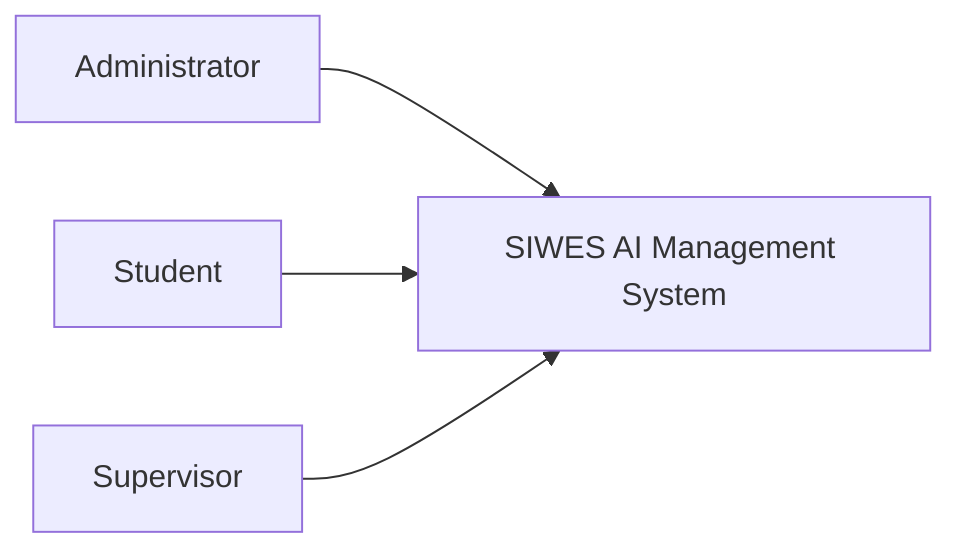
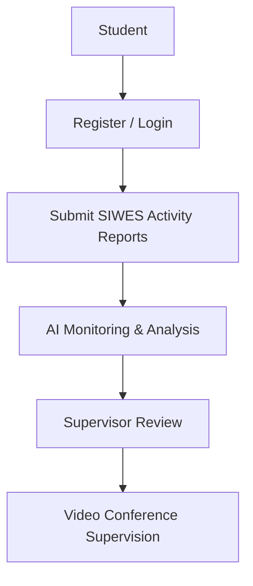
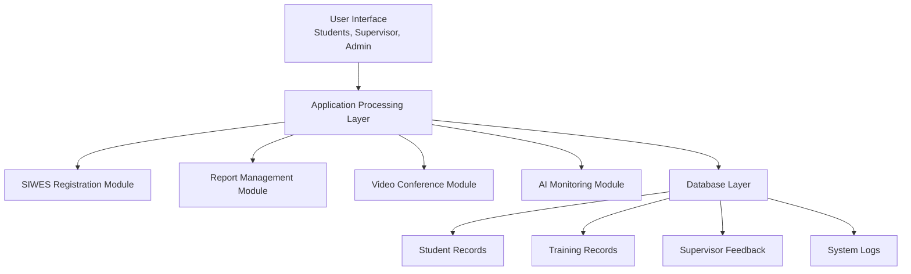

# Design and Implementation of an AI Enhanced SIWES Management System With Real-Time Supervision

**A Seminar Report**

**By:** Maduegbunam Faith Amarachi  
**Registration Number:** 2022 224 152

**Submitted to:**  
Department of Computer Science, Faculty of Physical Sciences

**In partial fulfilment of the requirement for the award of Bachelor of Science (B.Sc.) degree in Computer Science, Faculty of Physical Science.**

**Supervisor:** Dr Charity Onyiyechi  
**Date:** April, 2026

---

## Certification Page

I Maduegbunam Faith Amarachi in the Department of Computer Science, Chukwuemeka Odumegwu Ojukwu
University, Uli Campus with Registration Number 2022 224 152 has done here seminar in partial
fulfillment of the requirement for the award of Bachelor of Science (B.Sc) under the guidance of the
supervisor Dr Charity Onyiyechi

**Approved by:**

| Name/Role | Date |
|---|---|
| Dr Charity Onyiyechi, Seminar Supervisor | |
| Prof. I. J. Mgbeafuluike, Head of Department | |

## Dedication

I dedicate this research work to God almighty that made it possible for me to accomplish this work.

## Acknowledgements

My gratitude goes to almighty God for giving me the privilege to undergo this work successfully. I
will like to express my profound gratitude to my Seminar Supervisor Dr Charity Onyiyechi of the
department of Computer Science Chukwuemeka Odumegwu Ojukwu University, Uli For her unwavering
support and continuous encourage throughout the Seminar work. Without her guidance and persistent
help this report would not have been possible.

I must acknowledge the HOD Prof Ike Mgbefuike and other staff of Computer Science department
Chukwuemeka Odumegwu Ojukwu University Uli, Prof Ogochukwu. C. Okeke, Mrs. Chinwe Ndigwe and
Ezenwegbu Nnamdi. C.

It is my great pleasure to acknowledge my course-mate for providing ideas. I am especially grateful
to my parents for their prayers, care and moral support

## Abstract

The Student Industrial Work Experience Scheme (SIWES) is an important part of higher education in
Nigeria. It helps students gain practical experience and apply what they learn in class to real work
situations. However, the way SIWES is managed in many schools is still mostly manual, with problems
like poor supervision, weak communication, and bad record keeping. These issues make it difficult to
properly monitor students during their training and reduce the overall effectiveness of the program.
This study focuses on the design and implementation of an AI enhanced SIWES management system with
real-time supervision. The aim is to study the current system, identify its problems, and develop a
better system that improves supervision, communication, and data management. The proposed system is
a web-based platform that includes artificial intelligence and real-time communication features such
as video conferencing. It allows students to register their training places, submit reports, and
receive feedback easily. Supervisors can also monitor student progress, review reports, and hold
virtual meetings with students. The AI part of the system helps to analyze student reports and give
useful insights about their performance. The system was tested and it showed better performance in
terms of efficiency, supervision, communication, and record keeping. In conclusion, the system
provides a better and more modern way of managing SIWES and is recommended for use in Nigerian
tertiary institutions.

## Table of Contents

- Title Page
- Certification
- Dedication
- Acknowledgements
- Abstract
- Table of Contents
- List of Figures
- List of Tables
- Chapter One: Introduction
- 1.1 Background of the Study
- 1.2 Statement of the Problem
- 1.3 Aim and Objectives of the Study
- 1.4 Significance of the Study
- 1.5 Scope of the Study
- 1.6 Limitations of the Study
- 1.7 Definition of Terms
- Chapter Two: Literature Review
- 2.1 Theoretical Review
- 2.2 Review of Related Works
- 2.3 Summary of Literature Review and Knowledge Gap
- Chapter Three: Methodology and System Analysis
- 3.1 Methodology Adopted
- 3.2 System Analysis
- 3.3 Analysis of the Proposed System
- 3.4 Functional Requirements
- 3.5 Advantages of the Proposed System
- 3.6 High-Level Model of the Proposed System
- References

## List of Figures

- Fig 3.1: Data Flow Diagram (Level 0)
- Fig 3.2: Data Flow Diagram (Level 1)
- Fig 3.3: Use Case Diagram
- Fig 3.4: High-Level System Model

---

# Chapter One: Introduction
## 1.1 Background of the Study
The Student Industrial Work Experience Scheme (SIWES) is one of the most important practical
training programs introduced in Nigerian tertiary institutions. It was established by the Industrial
Training Fund to bridge the gap between theoretical classroom learning and practical workplace
experience. Through SIWES, students are exposed to real-life professional environments where they
can apply the knowledge and skills acquired during their academic studies. This training helps
students gain practical experience, develop technical competence, and improve their employability
after graduation. Participation in SIWES is compulsory for many courses such as computer science,
engineering, business administration, and other technology-related disciplines. According to
Industrial Training Fund guidelines, students are required to undergo industrial training for a
specified period, usually between three and six months, during which they work in organizations
relevant to their field of study. Recent studies have emphasized that SIWES plays a vital role in
preparing students for the labor market by exposing them to professional practices and workplace
expectations (Adewale and Olatunji, 2024).
Despite the importance of SIWES, the management of the scheme in many Nigerian institutions is still
largely manual and inefficient. In most cases, students are required to physically submit logbooks,
progress reports, and industrial training forms to their institutions. Supervisors also travel to
different organizations to monitor students during the training period. This manual process often
results in delays, poor documentation, and communication challenges between students, supervisors,
and institutions. Additionally, many institutions lack centralized digital platforms for tracking
student placements, monitoring training progress, and facilitating interaction between students and
supervisors. As a result, supervisors sometimes find it difficult to effectively monitor students’
activities during the industrial training period. According to Okeke and Nwafor (2024), the lack of
digital systems for managing SIWES has contributed to inefficiencies in monitoring, evaluation, and
reporting processes in many Nigerian universities.
The rapid advancement of information and communication technology has created new opportunities for
improving educational administration and remote collaboration. Modern digital systems now allow
institutions to automate many administrative processes, including student registration, academic
monitoring, and communication between stakeholders. One technological advancement that has gained
significant attention in recent years is video conferencing technology. Video conferencing enables
real-time communication between individuals in different locations through audio and visual
interaction using internet-enabled devices. Platforms such as Zoom, Google Meet, and Microsoft Teams
have demonstrated the effectiveness of virtual communication in education, particularly during the
global transition to online learning environments (Khan and Yusuf, 2025). Integrating video
conferencing features into a SIWES management system can significantly improve communication between
students, supervisors, and industrial organizations. Instead of relying solely on physical visits,
supervisors can conduct virtual supervision sessions, meetings, and evaluations using video
conferencing tools. This approach can reduce travel costs, save time, and enable more frequent
interactions between students and supervisors. It also ensures that students receive adequate
guidance during their industrial training period. Furthermore, the use of a centralized SIWES
management system can provide secure storage for student records, logbooks, and reports while
allowing supervisors to track student progress in real time. Research by Ibrahim and Bello (2025)
shows that digital management systems integrated with remote communication technologies can
significantly improve transparency, monitoring efficiency, and documentation in academic training
programs.
Universities and educational institutions are increasingly adopting digital management platforms to
improve academic administration and student supervision. These systems provide online dashboards,
automated reporting tools, and collaborative communication platforms that enhance coordination among
stakeholders. In the context of industrial training programs, digital platforms help institutions
monitor student activities more effectively and ensure that training objectives are achieved.
However, in many Nigerian institutions, the implementation of such integrated systems remains
limited due to technological, infrastructural, and financial challenges (Ogunleye and Ajayi, 2024).
This gap highlights the need for the development of innovative systems that can modernize the
management of SIWES programs. The design and implementation of a SIWES management system with video
conferencing features is essential for improving the coordination, monitoring, and evaluation of
industrial training programs. Such a system will provide a centralized platform where students can
register their training placements, submit reports, communicate with supervisors, and participate in
virtual supervision sessions. By leveraging modern digital technologies, the proposed system aims to
improve efficiency, transparency, and accessibility in the management of SIWES activities. The
development of this system aligns with the ongoing digital transformation in education and
contributes to the modernization of academic administration in Nigerian tertiary institutions (Eze
and Chukwu, 2025).
## 1.2 Statement of the Problem
The management of the Student Industrial Work Experience Scheme (SIWES) in many Nigerian
institutions is associated with several challenges that affect the effectiveness of the program.
These challenges often reduce the quality of supervision, monitoring, and documentation of students’
industrial training activities. As a result, many students do not fully benefit from the objectives
of the SIWES program.
One major challenge is the reliance on manual processes in managing SIWES activities. In many
institutions, students are required to fill out paper-based forms, maintain handwritten logbooks,
and submit printed reports to their departments. This manual approach increases the risk of errors,
loss of documents, and delays in processing important information. It also makes it difficult for
institutions to maintain accurate records of students’ industrial training activities. According to
Adewale and Olatunji (2024), manual documentation systems often lead to poor data management and
inefficiencies in monitoring academic training programs.
Another challenge is the difficulty faced by supervisors in effectively monitoring students during
their industrial training period. Supervisors are often required to travel to different
organizations where students are placed in order to assess their progress and provide guidance.
However, due to time constraints, financial limitations, and logistical challenges, supervisors may
not be able to visit all students regularly. This can result in inadequate supervision and limited
feedback for students. The absence of consistent communication between students and supervisors can
negatively affect the quality of the training experience (Okeke and Nwafor, 2024).
Limited communication between institutions, students, and industrial organizations is also a
challenge in the SIWES program. Many institutions do not have centralized platforms for coordinating
interactions among these stakeholders. As a result, communication is often carried out through
informal channels such as emails, phone calls, or physical meetings, which may not always be
reliable or efficient. This lack of structured communication can create misunderstandings and delays
in addressing student concerns during the training period (Ibrahim and Bello, 2025).
The absence of integrated digital tools for remote supervision further complicates the management of
SIWES activities is also a problem. Without the use of technologies such as video conferencing,
supervisors cannot easily conduct virtual meetings with students or evaluate their workplace
experiences in real-time. This limitation reduces opportunities for effective mentoring and academic
support during the training period. The integration of video conferencing technology into SIWES
management systems has the potential to address these challenges by enabling real-time interaction
and remote supervision between students and academic supervisors (Khan and Yusuf, 2025).
## 1.3 Aim and Objectives of the Study
The aim of this study is to design and implement an AI enhanced Siwes management system with real
time supervision.
### Objectives
The objectives of this study are to:
1. Design a centralized database for managing SIWES student records and training information.
2. Develop an AI-based module for analyzing students’ SIWES activities and performance.
3. Evaluate the effectiveness of the proposed system in improving SIWES management and supervision.
## 1.4 Significance of the Study
The significance of this study lies in its potential to improve the administration and monitoring of
the Student Industrial Work Experience Scheme in tertiary institutions. The proposed system
introduces a digital platform that simplifies the management of SIWES activities and enhances
communication among students, supervisors, and industrial organizations. The study will benefit
students by providing a convenient platform for submitting reports, updating training activities,
and communicating with supervisors. This will reduce the stress associated with physical
documentation and ensure that students receive timely feedback during their industrial training. The
study will also benefit supervisors by providing tools for monitoring students’ activities remotely.
The integration of video conferencing features will allow supervisors to conduct virtual meetings,
evaluate student progress, and provide guidance without necessarily visiting the training locations
physically.
Students will benefit greatly from the proposed system because it will provide a convenient platform
for submitting weekly reports, updating training activities, and communicating with their
supervisors. Instead of relying on manual logbooks and physical submissions, students will be able
to upload their reports and progress updates through the system. This will reduce the stress
associated with physical documentation, improve record keeping, and ensure that students receive
timely feedback during their industrial training period.
Lecturers and academic supervisors will also benefit from the system because it will provide tools
for monitoring and evaluating students’ industrial training activities more effectively. Through the
real-time supervision features, lecturers will be able to track students’ progress, review submitted
reports, and provide guidance without necessarily traveling to the training locations. The
integration of virtual communication features will also enable lecturers to interact with students,
conduct supervision sessions, and assess performance remotely.
The proposed system will further benefit school management and SIWES coordinators by improving the
overall administration of the industrial training program. The centralized database will allow the
institution to store, organize, and retrieve student SIWES records easily. This will help management
monitor student participation, track placement information, and generate reports for decision-making
and policy implementation related to industrial training programs. In addition, industrial
organizations that accept SIWES students will benefit from the improved communication and
coordination provided by the system. Organizations will be able to update students’ training
activities, provide feedback on student performance, and collaborate with academic supervisors more
effectively. This will strengthen the relationship between tertiary institutions and industry
partners.
Furthermore, the study will contribute to the advancement of digital technology in education by
demonstrating how information systems can improve academic administration and student supervision.
The system will help institutions maintain accurate records of SIWES activities and improve
transparency in the management of industrial training programs. The implementation of the proposed
system will improve efficiency, reduce administrative workload, and enhance the quality of
industrial training programs in Nigerian tertiary institutions.
## 1.5 Scope of the Study
The study focuses on the design and implementation of a SIWES management system with video
conferencing features for tertiary institutions. The system will provide functionalities for student
registration, industrial placement tracking, report submission, supervisor monitoring, and virtual
supervision through video conferencing.
The system will primarily be developed for use in computer science departments and related
disciplines where students participate in SIWES programs. The system will not replace the entire
SIWES administrative structure but will provide a digital platform to support and improve the
management of industrial training activities.
## 1.6 Limitations of the Study
During the course of this research, several limitations were encountered.
One limitation is the cost of system development and implementation. Developing a digital management
system with integrated video conferencing features requires technical expertise, software tools, and
reliable internet infrastructure.
Another limitation is unstable internet connectivity, which may affect the performance of the video
conferencing feature, particularly in areas with poor network coverage.
Frequent power supply interruptions also posed challenges during the development and testing of the
system, as consistent electricity is necessary for software development and system operation.
Financial constraints affected access to certain research materials, technical resources, and
software development tools needed for the implementation of the system.
## 1.7 Definition of Terms
1. **Database:** A database is an organized collection of structured information stored
electronically for easy access, management, and retrieval.
2. **Industrial Training:** Industrial training refers to the practical work experience that
students gain by working in organizations related to their academic discipline.
3. **Management System:** A management system is a software application designed to organize,
monitor, and control specific processes within an organization.
4. **SIWES (Student Industrial Work Experience Scheme):** SIWES is a skill development program
established by the Industrial Training Fund to provide students in tertiary institutions with
practical industrial experience related to their field of study.
5. **Supervisor:** A supervisor is an academic staff member responsible for monitoring and
evaluating students during their industrial training period.
6. **User Interface:** A user interface is the visual part of a software application that allows
users to interact with the system through screens, menus, and input forms.
7. **Video Conferencing:** Video conferencing is a technology that allows people in different
locations to communicate through live audio and video using internet-enabled devices.
## References
Adewale, T., & Olatunji, A. (2024). Digital transformation in higher education administration.
International Journal of Educational Technology, 15(2), 44–56.
Eze, P., & Chukwu, C. (2025). Adoption of information systems in Nigerian universities. Journal of
Educational Information Systems, 18(1), 22–37.
Ibrahim, S., & Bello, M. (2025). Improving academic supervision using digital platforms. African
Journal of Educational Technology, 11(3), 61–74.
# Chapter Two: Literature Review
## 2.1 Theoretical Review
### 2.1.1 SIWES and Industrial Training Management Systems
The Students Industrial Work Experience Scheme (SIWES) is a structured program designed to expose
Nigerian students to practical work experience relevant to their academic disciplines. It was
established by the Industrial Training Fund to bridge the gap between theoretical knowledge and
real-world application. However, the management of SIWES in many institutions remains largely
manual, involving physical logbooks, handwritten reports, and irregular supervisory visits. These
traditional approaches often lead to inefficiencies such as poor documentation, delayed feedback,
and weak accountability mechanisms. According to recent studies, supervision challenges persist due
to limited resources, high student-to-supervisor ratios, and logistical constraints (Adebayo and
Salau, 2024). Furthermore, poor communication between institutions and industry partners reduces the
effectiveness of the program. Scholars have emphasized that the absence of centralized digital
systems contributes significantly to inconsistencies in monitoring and evaluation processes (Okeke
et al., 2025). As a result, there is an increasing need for automated and intelligent systems to
improve coordination, monitoring, and documentation within SIWES.
### 2.1.2 Existing SIWES Management Systems
Existing SIWES management systems have transitioned from manual processes to partially digitized and
web-based platforms. Traditional systems rely on paper-based logbooks, which are susceptible to
loss, damage, and manipulation. In response, several digital systems have been developed to enhance
efficiency and accessibility. These systems allow students to submit reports online while enabling
supervisors to review and grade performance remotely. Features such as electronic logbooks,
automated grading, and centralized data storage have significantly improved transparency and
accountability (Ogunleye and Adeyemi, 2024). Despite these advancements, many existing systems still
lack advanced capabilities such as real-time monitoring and intelligent analytics. Studies show that
most platforms operate as static reporting tools rather than dynamic supervisory systems (Eze and
Nwankwo, 2025). Consequently, they fail to address critical challenges such as delayed supervision
and lack of proactive intervention. This highlights the need for integrating advanced technologies
like artificial intelligence into SIWES management systems.
### 2.1.3 Artificial Intelligence in Educational Systems
Artificial Intelligence (AI) has become increasingly significant in modern educational systems due
to its ability to automate processes and enhance decision-making. AI technologies such as machine
learning, natural language processing, and predictive analytics are widely used to improve teaching,
learning, and administrative functions. In education, AI enables personalized learning experiences,
automated assessments, and intelligent recommendations for students. Recent research indicates that
AI can significantly improve student performance tracking and institutional efficiency (Ibrahim and
Yusuf, 2024). Additionally, AI systems can analyze large volumes of data to identify patterns,
predict outcomes, and support informed decision-making. In the Nigerian educational context, the
adoption of AI is gradually increasing, although challenges such as limited infrastructure and
technical expertise persist (Chukwu and Oladipo, 2025). Despite these limitations, AI remains a
promising solution for enhancing supervision, monitoring, and evaluation processes in programs like
SIWES
### 2.1.4 Real-Time Supervision Technologies
Real-time supervision technologies refer to digital systems that allow continuous monitoring and
instant feedback during activities such as student training programs. These technologies utilize web
platforms, mobile applications, cloud computing, and sometimes GPS tracking to ensure timely
supervision. In SIWES, real-time supervision can significantly improve accountability by enabling
supervisors to monitor student activities as they occur rather than relying on delayed reports.
According to recent studies, real-time systems enhance communication between students, supervisors,
and institutions, thereby improving coordination and performance evaluation (Nwachukwu and Bello,
2024). Furthermore, cloud-based supervision systems enable centralized data storage and instant
access to information, which supports effective decision-making. However, challenges such as poor
internet connectivity, high implementation costs, and limited digital literacy hinder widespread
adoption in developing countries (Adekunle et al., 2025). Despite these challenges, real-time
supervision remains a critical component of modern SIWES management systems.
### 2.1.5 Web and Mobile-Based Management Systems
Web and mobile-based management systems are essential tools for modern educational administration,
providing flexible and accessible platforms for managing student activities. These systems allow
users to access information from any location, thereby improving efficiency and convenience. In
SIWES management, web-based platforms enable students to submit reports, supervisors to monitor
progress, and administrators to manage records effectively. Technologies such as HTML, CSS,
JavaScript, and backend frameworks are commonly used to develop these systems. Research shows that
digital platforms significantly reduce paperwork, improve data accuracy, and enhance communication
among stakeholders (Olatunji and Emeka, 2024). Mobile applications further extend accessibility by
allowing users to interact with the system in real time. However, issues such as cybersecurity
risks, network reliability, and user adoption remain significant concerns (Usman and Ibrahim, 2025).
Nonetheless, the integration of web and mobile technologies continues to play a vital role in
improving SIWES management systems.
## 2.2 Review of Related Works
### 1. Artificial Intelligence in Educational Administration
Garzón, Patiño, and Marulanda (2025) examined the role of Artificial Intelligence in educational
administration and identified how AI technologies improve decision-making, automate academic
processes, and enhance institutional efficiency. Their research demonstrated that AI systems can
analyze large datasets to support academic planning and improve administrative management in
universities. However, the study mainly focused on teaching and learning environments and did not
address the application of AI in industrial training programs such as SIWES.
### 2. AI-Driven Monitoring Systems in Higher Education
Zawacki-Richter et al. (2024) conducted a systematic review of Artificial Intelligence applications
in higher education institutions. The study identified several areas where AI systems have been
successfully applied, including student performance prediction, learning analytics, and academic
advising systems. Their findings show that AI-driven monitoring systems can significantly improve
student engagement and institutional decision-making. Despite these advancements, the research did
not explore the use of AI for supervising off-campus training activities such as internships or
industrial work placements.
### 3. Intelligent Systems for Academic Supervision
Holmes, Bialik, and Fadel (2023) explored the use of intelligent educational systems to improve
academic supervision and student support. Their research revealed that AI powered systems can
provide automated feedback, monitor student learning progress, and assist educators in managing
large student populations. Although the study highlighted the benefits of intelligent systems in
education, it did not specifically address industrial training programs where supervision takes
place outside the university environment.
### 4. Digital Platforms for Academic Administration
Ogunleye and Ajayi (2024) investigated the use of digital platforms in academic administration
across developing countries. Their research showed that digital management systems improve
institutional efficiency by automating administrative tasks such as student registration, record
management, and communication. However, their study did not include real-time monitoring
technologies or AI-driven supervision features that are required for effective SIWES management.
### 5. Video Conferencing Technology in Education
Khan and Yusuf (2025) studied the use of video conferencing technologies in modern educational
systems. Their findings showed that virtual communication platforms significantly improve
collaboration, remote learning, and academic consultations between students and lecturers. The
research highlighted the effectiveness of tools such as Zoom, Google Meet, and Microsoft Teams in
facilitating online communication. However, the study focused mainly on virtual classrooms and did
not examine how video conferencing could be integrated into industrial training supervision systems.
### 6. Real-Time Communication Systems in Educational Programs
Ibrahim and Bello (2025) investigated the effectiveness of real-time communication systems in
educational programs. Their research demonstrated that digital communication platforms improve
interaction between students and instructors, allowing immediate feedback and guidance. While the
study emphasized the benefits of real-time communication technologies, it did not include the
integration of Artificial Intelligence for monitoring student activities.
### 7. Information Systems for Student Management
Laudon and Laudon (2024) examined the role of management information systems in organizational
decision-making. Their work explained how information systems collect, process, and store data to
support management operations. In educational institutions, such systems are used to manage student
records, academic performance data, and administrative processes. However, their research provided
only a general overview of information systems and did not specifically focus on AI-enhanced
supervision systems.
### 8. Machine Learning for Educational Analytics
Jordan and Mitchell (2023) explored machine learning applications in various fields including
education. Their study explained how machine learning algorithms analyze large datasets to identify
patterns and generate predictions. In educational environments, ML models can be used to predict
student performance, detect learning difficulties, and recommend academic interventions. However,
the study did not examine the use of machine learning for managing industrial training programs.
### 9. Digital Transformation in Higher Education
Adewale and Olatunji (2024) examined digital transformation initiatives in higher education
institutions. Their findings showed that digital technologies improve efficiency, transparency, and
accessibility in academic administration. The research emphasized the need for universities to adopt
modern digital management systems to improve institutional performance. Nevertheless, the study did
not address the integration of AI technologies for industrial training supervision.
### 10. Challenges in Managing SIWES Programs
Okeke and Nwafor (2024) investigated the challenges associated with managing the Student Industrial
Work Experience Scheme in Nigerian universities. Their study identified several issues including
poor documentation, inadequate supervision, and lack of communication between institutions and
students. The research concluded that the absence of digital monitoring systems contributes
significantly to these challenges.

## 2.3 Summary of Literature Review and Knowledge Gap

| Name | Works | Limitations | Contribution to Evolution | What I Intend to Improve/Correct |
|---|---|---|---|---|
| Garzón et al. (2025) | Studied the integration of Artificial Intelligence in educational systems. | Focused mainly on learning environments rather than industrial training programs. | Demonstrated the role of AI in improving educational administration. | Apply AI specifically to SIWES management and monitoring. |
| Holmes et al. (2023) | Examined AI technologies for improving academic processes. | Did not address supervision challenges in industrial training programs. | Highlighted the importance of intelligent systems in education. | Develop an AI system that supports real-time supervision. |
| Zawacki-Richter et al. (2024) | Investigated AI applications in higher education. | Research focused on teaching and learning analytics. | Provided insights into AI-driven educational analytics. | Extend AI analytics to monitor industrial training activities. |
| Khan & Yusuf (2025) | Studied the use of video conferencing technologies in education. | Limited focus on supervision of industrial training programs. | Demonstrated effectiveness of virtual communication tools. | Integrate video conferencing into SIWES management systems. |
| Ibrahim & Bello (2025) | Examined digital supervision systems for academic programs. | Did not incorporate AI technologies for monitoring. | Highlighted benefits of digital supervision platforms. | Combine AI monitoring with digital supervision tools. |
| Ogunleye & Ajayi (2024) | Investigated digital platforms for academic administration. | Systems lacked real-time monitoring features. | Provided frameworks for digital academic management. | Implement real-time monitoring capabilities in SIWES systems. |
| Eze & Chukwu (2025) | Studied adoption of information systems in Nigerian universities. | Did not focus on industrial training programs. | Highlighted the importance of digital systems in institutional management. | Develop a specialized system for SIWES administration. |
| Adewale & Olatunji (2024) | Examined digital transformation in higher education administration. | Research lacked AI-based monitoring components. | Demonstrated benefits of digital management platforms. | Integrate AI features into industrial training management. |
| Okeke & Nwafor (2024) | Studied challenges in managing SIWES programs in Nigerian universities. | Identified problems but did not propose a technological solution. | Highlighted supervision and documentation challenges. | Provide an AI-based solution to improve supervision and record management. |
| Laudon & Laudon (2024) | Examined the role of intelligent information systems in organizations. | General focus on information systems rather than education. | Provided theoretical foundations for intelligent information systems. | Apply intelligent information systems to SIWES program management. |

## References
Adewale, T., & Olatunji, A. (2024). Digital transformation in higher education administration.
International Journal of Educational Technology, 15(2), 44–56.
Eze, P., & Chukwu, C. (2025). Adoption of information systems in Nigerian universities. Journal of
Educational Information Systems, 18(1), 22–37.
Garzón, J., Patiño, A., & Marulanda, M. (2025). Artificial intelligence in education: Current trends
and future directions. Computers & Education, 201, 104812.
# Chapter Three: Methodology and System Analysis
## 3.1 Methodology Adopted
The methodology adopted for this research is the Object-Oriented Analysis and Design Methodology
(OOADM). This methodology is selected because it provides a structured and organized approach to the
development of software systems by dividing the system into objects that represent real-world
entities. In object-oriented methodology, each component of the system is designed as an object that
performs specific functions and interacts with other components to achieve the overall objective of
the system. According to researchers in Software Engineering, object-oriented design improves system
modularity, maintainability, and scalability in modern software development environments.
OADM is widely used in the development of modern information systems because it allows developers to
analyze system requirements carefully before implementation. The methodology focuses on identifying
system actors, system processes, data structures, and relationships between different system
components. Through this process, developers are able to create systems that are flexible and easy
to upgrade in the future. Studies have shown that object-oriented methodologies significantly
improve software reliability and system efficiency in educational management systems (Sommerville,
2024).
In this project, OOADM is used to analyze the requirements of the AI-enhanced SIWES management
system, identify the major components of the system, and design how the system will function. The
methodology also helps in modeling the system using diagrams such as the Use Case Diagram, Data Flow
Diagram, and High-Level System Model. These diagrams provide a visual representation of how users
interact with the system and how data flows within the system during operation.
## 3.2 System Analysis
### 3.2.1 Analysis of the Existing System
The existing SIWES management system used in many institutions operates mainly through manual
processes. Students are required to register for the program, obtain placement in organizations, and
keep a physical logbook where they record their daily training activities. Supervisors later visit
the organizations to verify the students’ activities and assess their performance. Although this
method has been used for many years, it has several limitations. First, manual record keeping makes
it difficult for institutions to maintain accurate records of student activities. Paper-based
documentation can easily be lost, damaged, or incorrectly recorded.
Another limitation of the existing system is the lack of effective supervision. Due to time
constraints and large numbers of students participating in the SIWES program, supervisors may not be
able to monitor students regularly. This reduces the effectiveness of the training program and may
affect the quality of learning outcomes. Communication between students and supervisors is often
limited. Students usually rely on phone calls, emails, or occasional meetings to communicate with
supervisors. This method does not allow continuous monitoring of students’ progress during the
training period.
### 3.2.2 Weakness of the Existing System
The existing SIWES management system used in many higher institutions has several limitations that
reduce the efficiency of supervision and documentation during industrial training. The major
weaknesses include the following:
1. **Lack of Real-Time Supervision:** Supervisors are often unable to monitor students regularly
during their industrial training because supervision mostly depends on physical visits. This
makes it difficult to track student activities continuously (Okeke & Nwafor, 2024).
2. **Poor Communication Between Students and Supervisors:** Communication between students and
supervisors usually occurs through phone calls or emails, which may delay feedback and support
when students encounter challenges during their training.
3. **Manual Record Keeping:** Students often record their daily activities in physical logbooks.
Paper-based records can easily be misplaced, damaged, or incorrectly documented, making it
difficult for institutions to maintain accurate records (Laudon & Laudon, 2024).
4. **Difficulty in Monitoring Student Progress:** Because reports are submitted manually,
supervisors cannot easily track the progress of students throughout the training period.
5. **Time-Consuming Supervision Process:** Supervisors must travel to different organizations to
inspect students, which consumes time and financial resources.
6. **Inefficient Report Management:** Managing large volumes of physical reports from many students
can be difficult for institutions.
7. **Limited Use of Modern Technology:** The traditional system does not integrate modern
technologies such as Artificial Intelligence or digital supervision platforms that can improve
SIWES management (Garzón et al., 2025).
## 3.3 Analysis of the Proposed System
The proposed system is an AI-Enhanced SIWES Management System with Real-Time Supervision designed to
improve the management and monitoring of students participating in industrial training programs. The
system will provide a centralized digital platform where students, supervisors, and administrators
can interact. Students will be able to register their SIWES placement, submit weekly reports, and
communicate with supervisors through the system. Supervisors will be able to monitor student
progress, review submitted reports, and schedule virtual supervision sessions.
One of the key features of the proposed system is the integration of video conferencing technology,
which allows supervisors to conduct virtual supervision meetings with students. This feature
eliminates the need for frequent physical visits while still enabling effective supervision.
The system will also incorporate Artificial Intelligence capabilities to analyze student activity
reports and provide insights about student performance during the training period. AI technologies
can help identify patterns, detect irregularities, and support supervisors in monitoring students
effectively. Overall, the proposed system will improve efficiency, transparency, and communication
in the SIWES management process.

**Fig 3.1: Data Flow Diagram (Level 0)**

**Fig 3.2: Data Flow Diagram (Level 1)**

**Fig 3.3: Use Case Diagram**

> Use case diagram placeholder from the source text.

**Fig 3.4: High-Level System Model**

## 3.4 Functional Requirements
The system must meet operational and technical requirements to deliver its objectives. These
requirements include
1. **User Registration and Authentication:** The system should allow students, supervisors, and
administrators to create accounts and securely log in to the platform.
2. **Student SIWES Placement Registration:** Students should be able to register their industrial
training placement details through the system.
3. **Profile Management:** Users should be able to update and manage their personal information
within the system.
4. **Submission of Training Reports:** The system should allow students to submit daily or weekly
SIWES reports electronically instead of using physical logbooks.
5. **Supervisor Report Review:** Supervisors should be able to review student reports and provide
feedback directly through the system.
6. **Real-Time Communication:** The system should provide communication tools that allow students
and supervisors to interact easily during the training period.
7. **Video Conferencing for Virtual Supervision:** Supervisors should be able to conduct virtual
supervision sessions with students through integrated video conferencing tools.
8. **AI-Based Monitoring and Analysis:** The system should include Artificial Intelligence features
capable of analyzing student reports and identifying patterns in training activities (Floridi et
al., 2023).
9. **Notification and Alert System:** The system should notify students and supervisors about new
reports, feedback, or scheduled supervision sessions.
## 3.5 Advantages of The Proposed System
The proposed AI-enhanced SIWES management system offers several advantages over the existing manual
system.
1. **Improvement in supervision efficiency:** By integrating real-time monitoring and communication
tools, supervisors can monitor students’ activities remotely without the need for frequent
physical visits. This helps reduce travel costs and saves time for both students and
supervisors.
2. **Improvement in communication between students and supervisors:** The integration of video
conferencing and messaging tools allows students to easily contact their supervisors whenever
they need guidance. Modern communication platforms such as Microsoft Teams and Google Meet have
demonstrated how virtual communication technologies can enhance collaboration and interaction in
educational environments (Khan & Yusuf, 2025).
3. **Data management and record keeping:** All SIWES reports and student records will be stored
digitally in a centralized database. This eliminates the risks associated with paper based
documentation such as loss or damage of records. Digital databases allow institutions to
retrieve and analyze information more efficiently.
4. **Use of Artificial Intelligence for monitoring and analysis:** AI technologies can assist
supervisors by analyzing student reports and identifying trends or irregularities in student
activities. This helps institutions maintain better oversight of industrial training programs and
ensures that students gain meaningful learning experiences.
5. **Transparency and accountability in the SIWES program:** Since all activities are recorded
digitally, institutions can easily track student progress and supervisor feedback, which
improves the overall management of the training program
## 3.6 High-Level Model of The Proposed System
The system follows a modular architecture: The high-level model of the proposed AI-enhanced SIWES
management system describes the major components of the system and how they interact with one
another. This model provides a simplified representation of the system architecture and helps
developers understand the overall structure of the system before implementation. These includes
1. **User Interface Layer:** This layer provides the interface through which users interact with
the system. It includes web or mobile interfaces used by students, supervisors, and
administrators. Through this interface, students can submit reports, supervisors can review
activities, and administrators can manage the system. User interface design is an important
aspect of modern software systems because it determines how easily users can interact with the
application (Sommerville, 2024).
2. **Application Processing Layer:** which contains the main logic of the system. This layer
processes user requests and performs operations such as report submission, user authentication,
video conferencing communication, and AI-based analysis of student reports. It acts as the
central processing unit of the system and ensures that all functions operate correctly.
3. **Artificial Intelligence Module:** This module analyzes data generated from student reports and
supervision activities. The AI module can identify patterns in student activities and provide
insights that help supervisors evaluate student performance more effectively. Research shows
that AI-driven analytics improves decision-making and monitoring in educational systems
(Zawacki-Richter et al., 2024).
4. **Database Layer:** which stores all system data including student records, training reports,
supervisor feedback, and system logs. The database ensures that information is securely stored
and can be retrieved whenever needed. Modern information systems rely heavily on database
management systems to maintain data accuracy and security (Laudon and
Laudon, 2024).
## References
Garzón, J., Patiño, A., & Marulanda, J. (2025). Artificial intelligence in higher education
management. Computers and Education: Artificial Intelligence.
Holmes, W., Bialik, M., & Fadel, C. (2023). Artificial intelligence in education: Promise and
implications for teaching and learning. Center for Curriculum Redesign.
Laudon, K. C., & Laudon, J. P. (2024). Management information systems: Managing the digital firm.

## References
Adebayo, T., & Salau, R. (2024). Challenges in the implementation of SIWES in Nigerian universities.
Journal of Educational Development, 12(2), 45–58.
Adewale, T., & Olatunji, A. (2024). Digital transformation in higher education administration.
International Journal of Educational Technology, 15(2), 44–56.
Adekunle, M., Hassan, A., & Bello, S. (2025). Real-time monitoring systems in developing countries:
Challenges and opportunities. International Journal of Information Systems, 18(1), 66–79.
Chukwu, P., & Oladipo, O. (2025). Adoption of artificial intelligence in Nigerian education systems.
African Journal of Educational Technology, 9(1), 22–35.
Eze, C., & Nwankwo, J. (2025). Evaluation of digital internship management systems in higher
institutions. Journal of Computer Science Applications, 14(3), 101–115.
Eze, P., & Chukwu, C. (2025). Adoption of information systems in Nigerian universities. Journal of
Educational Information Systems, 18(1), 22–37.
Garzón, J., Patiño, A., & Marulanda, M. (2025). Artificial intelligence in education: Current trends
and future directions. Computers & Education, 201, 104812.
Holmes, W., Bialik, M., & Fadel, C. (2023). Artificial intelligence in education: Promise and
implications for teaching and learning. Center for Curriculum Redesign.
Ibrahim, M., & Yusuf, L. (2024). Artificial intelligence applications in education: A developing
country perspective. International Journal of AI Research, 7(2), 55–70.
Ibrahim, S., & Bello, M. (2025). Improving academic supervision using digital platforms. African
Journal of Educational Technology, 11(3), 61–74.
Jordan, M. I., & Mitchell, T. M. (2023). Machine learning: Trends, perspectives, and prospects.
Science, 349(6245), 255–260.
Khan, R., & Yusuf, A. (2025). The role of video conferencing technologies in modern education.
Journal of Educational Communication, 13(1), 30–45.
Laudon, K. C., & Laudon, J. P. (2024). Management information systems: Managing the digital firm
(17th ed.). Pearson.
Nwachukwu, K., & Bello, A. (2024). Enhancing student supervision through real-time technologies.
Journal of Educational Innovation, 11(4), 88–102.
Ogunleye, S., & Adeyemi, K. (2024). Development of a web-based SIWES management system. Nigerian
Journal of Computing, 10(2), 34–47.
Ogunleye, S., & Ajayi, T. (2024). Digital platforms for academic administration in developing
countries. International Journal of Educational Management, 19(2), 50–63. Okeke, I., & Nwafor, G.
(2024). Challenges in managing SIWES programs in Nigerian universities. Nigerian Journal of
Educational Research, 8(1), 70–85.
Okeke, I., Ezeh, G., & Obi, N. (2025). Digital transformation in student industrial training
programs. International Journal of Academic Research, 13(1), 77–90.
Olatunji, F., & Emeka, U. (2024). Web-based platforms for educational management systems. Journal of
Information Technology Education, 15(2), 120–134.
Usman, A., & Ibrahim, S. (2025). Security challenges in mobile-based educational systems.
International Journal of Cybersecurity Studies, 6(1), 40–52.
Zawacki-Richter, O., Marín, V. I., Bond, M., & Gouverneur, F. (2024). Systematic review of research
on artificial intelligence applications in higher education. International Journal of Educational
Technology in Higher Education, 21(1), 1–27.
