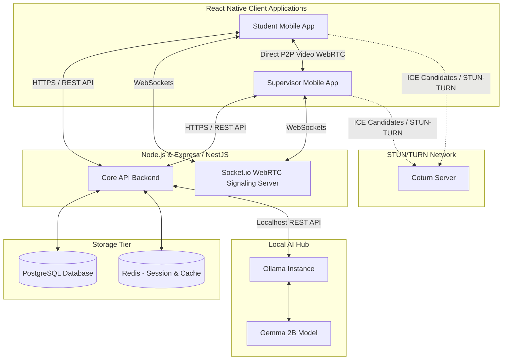
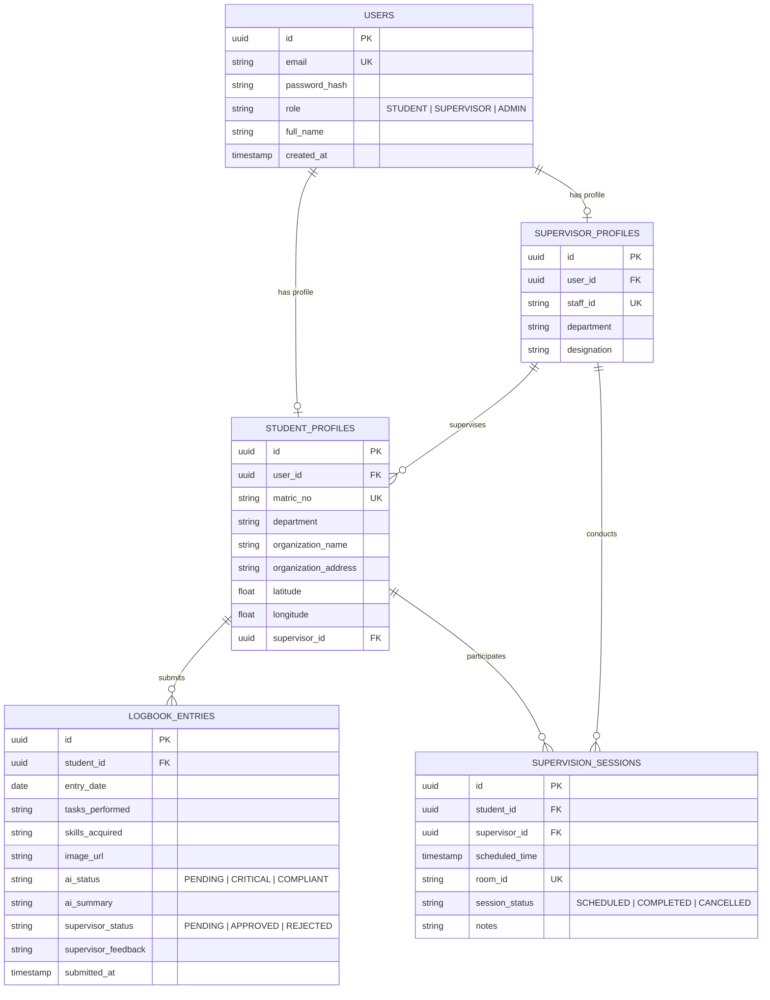

# Technical Design Document (TDD): AI-Enhanced SIWES Management System

This document serves as the Technical Design and Test-Driven Development (TDD) specification for the **AI-Enhanced SIWES (Student Industrial Work Experience Scheme) Management System with Real-Time Supervision**. It defines the architecture, user flows, database structures, and testing strategies required to construct a production-ready application.

---

## 1. Project Brief & Vision

The Student Industrial Work Experience Scheme (SIWES) is a critical educational program in Nigeria, bridging the gap between theoretical study and practical work experience. However, the legacy administration method relies on manual paper logbooks, physically intensive supervisor check-ins, and slow, delayed feedback loops.

This project introduces a modern, **production-ready mobile application** built using **React Native** that automates the SIWES administrative and supervisory workflow:
- **Real-Time Video Supervision**: Built on **WebRTC** to allow supervisors to conduct face-to-face evaluations, verify placements, and mentor students remotely without high travel costs.
- **AI-Powered Progress Analysis**: Utilizes **Gemma 2B** running locally on **Ollama** to analyze logbook entries, flag low-quality or plagiarized logs, summarize key learnings, and suggest feedback to supervisors.
- **Unified Portal**: Provides distinct, high-fidelity interfaces for both **Students** and **Supervisors**.

### Brand Identity & Design System
To establish a premium, trustworthy look and feel, the platform adopts a curated **Emerald Forest & Amber Gold** color scheme, leaning heavily into shades of deep green to represent growth, education, and professional development, complemented by energetic yellow accents.

```ini
Primary (Dominant Green):   #0F5132 (Deep Forest Green)
Secondary Green:            #198754 (Active Emerald Green)
Accent Color (Yellow):       #FFC107 (Amber Yellow / Gold)
Dark Neutral Background:     #121814 (Sleek Dark Slate Green)
Light Neutral Background:    #F8F9FA (Off-White/Cool Gray)
Alert/Destructive Color:     #DC3545 (Crimson Red)
```

---

## 2. System Architecture

The system utilizes a modern, distributed architecture designed for low-latency video communication and high-performance offline-first logbook entries.



### Components Detailed:
1. **React Native Client**: Renders native views on iOS & Android using custom WebRTC wrappers (`react-native-webrtc`). Employs Local Storage (SQLite or AsyncStorage) for offline-first logbook entry caching.
2. **API Backend**: Express/NestJS handling user authentication, log submissions, verification, notifications, and scheduling.
3. **WebRTC Signaling Server**: Lightweight WebSocket node (Socket.io) facilitating SDP exchanges and ICE candidates between students and supervisors.
4. **AI Module (Ollama + Gemma 2B)**: Executes locally on-premise or inside a private cloud cluster to bypass expensive API calls and guarantee students' data privacy. Performs NLP categorization and feedback suggestion.
5. **STUN/TURN Servers**: Coturn is deployed to handle NAT traversal, ensuring video streams can establish connections across varying firewalls and carrier networks in Nigeria.

---

## 3. Data Structure Flow & Entity Schema

The PostgreSQL database maintains strict relational integrity to track placements, logbook approvals, and supervision sessions.



---

## 4. UI Flow & High-Fidelity Wireframe Specifications

### 4.1 Student App Flow

```
[Splash Screen] 
       │
       ▼
[Login / Sign Up] (Email/Password, Department, Matric No, Placement Details with Geo-location)
       │
       ▼
[Student Dashboard]
 ├── Core Brand Theme: Dark Forest (#0F5132) Header, Clean White Body, Yellow (#FFC107) Accent Buttons.
 ├── **Metrics Section**: Days Completed (e.g., 45/90), Logs Approved, Pending, Rejected.
 ├── **Quick Action**: "Add Today's Log" & "Join Live Call" (visible when active).
 ├── **Bottom Navigation**: Dashboard, Logbook, Video Sessions, Profile.
       │
       ├─► [Logbook Entry Form]
       │    ├── Select Date (Defaults to today)
       │    ├── Text Area: "Detailed Tasks Performed"
       │    ├── Text Area: "Skills and Technologies Utilized"
       │    ├── Attachment: Photo Upload (Workplace proof)
       │    ├── **AI Assistant Component**: Click "Review with Gemma AI" to get instant constructive
       │    │   feedback on spelling, details, or missing engineering terminologies before submitting.
       │    └── Action: [Submit Logbook Entry]
       │
       ├─► [Video Supervision Call Screen]
       │    ├── View scheduled sessions.
       │    └── Active session shows green pulse. Tap "Enter Conference Room" -> launches WebRTC peer view.
       │
       └─► [Profile & Placement Settings]
            └── View department advisor details, organization address, and location validation status.
```

### 4.2 Supervisor App Flow

```
[Splash Screen]
       │
       ▼
[Login / Authentication] (Staff ID verification)
       │
       ▼
[Supervisor Dashboard]
 ├── Core Brand Theme: Classic Rich Green (#198754) Header, Slate Dark Background elements.
 ├── **Metrics**: Assigned Students Count, Pending Logbooks to review, Scheduled Calls today.
 ├── **Student Status Grid**: Dynamic card listing showing each student's name, matric number, placement firm,
 ├── and AI Health Indicator badge:
 ├──   - 🔴 Critical (Low report detail / suspicious activity)
 ├──   - 🟡 Warning (Late submission)
 ├──   - 🟢 Compliant (High detail, consistent logs)
       │
       ├─► [Student Detail & Logbook Approval Portal]
       │    ├── Student Profile overview (Geo-location verification map view).
       │    ├── Timeline of weekly log submissions.
       │    ├── Detailed review window:
       │    │    ├── Tasks & Skills submitted.
       │    │    ├── **Gemma AI Insight Box**: Auto-generated evaluation summary, grammatical analysis,
       │    │    │   and a pre-compiled feedback recommendation draft (saves supervisor typing time).
       │    │    └── Action buttons: [Approve Log] (Green) / [Request Re-submission] (Yellow / Red).
       │
       ├─► [Virtual Supervision Hub]
       │    ├── List of calls. Click "Schedule New Evaluation Session" -> sets date/time & generates Room ID.
       │    └── Call trigger interface: Employs full-screen peer video window, local mic/camera toggles,
       │        and inline note-taking overlay that saves directly to student records.
       │
       └─► [Analytics & Reports Panel]
            └── Export CSV files of student ratings and attendance for university department grading records.
```

---

## 5. WebRTC Video Call Integration Protocol

For high reliability across mobile networks, WebRTC setup must adhere to this negotiation flow:

1. **Signaling Initialization**: 
   - Both devices join the same dynamic room via Socket.io: `socket.emit('join-room', { roomId, userId })`.
2. **SDP Offer/Answer Exchange**:
   - The Supervisor App (initiator) calls `peerConnection.createOffer()`, sets it locally, and sends it: `socket.emit('sdp-offer', { targetId, offer })`.
   - The Student App receives the offer, sets it remote, creates an answer `peerConnection.createAnswer()`, sets it local, and replies back.
3. **ICE Candidates**:
   - Both clients listen to `peerConnection.onicecandidate` and transmit raw candidates over WebSockets to exchange network paths.
4. **Resolution Fallback**:
   - Bandwidth constraints are addressed by limiting video parameters to **640x480 at 15 FPS** by default inside constraints configuration. This minimizes cellular data cost and prevents video drops in areas with lower signal strength.

---

## 6. Gemma 2B AI Integration (Local Ollama)

The AI module uses local REST calls to Ollama. The Gemma 2B model is instructed via system prompt parameters to evaluate logbook quality and suggest improvements.

### Ollama Prompt Structure Definition
```json
{
  "model": "gemma:2b",
  "prompt": "SYSTEM: You are an academic SIWES evaluator analyzing a student's daily report. Identify: 1) Quality rating (Poor, Medium, Good). 2) Summary of technical skills learned. 3) Any spelling mistakes or vague sentences. 4) A suggested supervisor comment.\nREPORT: \"Today I worked at the server room and helped them check some computer network stuff. It was fine.\"\nANALYSIS:",
  "stream": false,
  "options": {
    "temperature": 0.2
  }
}
```

### Response Mapping Payload:
```json
{
  "quality_rating": "Poor",
  "technical_skills": ["Computer Hardware Troubleshooting", "Network Maintenance Basics"],
  "flags": ["The report lacks detail. What specific 'network stuff' was checked? E.g., Router configuration, LAN cable crimping?"],
  "suggested_comment": "Please provide a more detailed description of the tasks you performed in the server room, highlighting the tools, devices, or protocols you configured."
}
```

---

## 7. Test-Driven Development (TDD) Specifications

Following TDD practices, unit and integration tests must be written **before** modifying controller logic. Below are concrete, production-ready tests written using **Jest** and **Supertest** to validate core system logic.

### 7.1 Backend: Logbook Evaluation Service Test (`logbook.test.js`)

This test asserts that when a logbook is submitted, the AI evaluation is triggered and the correct schema states are recorded.

```javascript
const request = require('supertest');
const app = require('../src/app'); // Express Application instance
const db = require('../src/config/database');

describe('SIWES Logbook TDD Suite', () => {
  beforeAll(async () => {
    // Run database migrations and seed tests
    await db.migrate.latest();
  });

  afterAll(async () => {
    await db.destroy();
  });

  it('should reject log submission if details are completely missing', async () => {
    const response = await request(app)
      .post('/api/logbook/submit')
      .send({
        studentId: "a3b907b2-132d-4871-88dc-91b42cd3b98c",
        tasksPerformed: "",
        skillsAcquired: "JavaScript"
      });

    expect(response.status).toBe(400);
    expect(response.body.error).toContain("tasksPerformed is required");
  });

  it('should accept valid submissions and flag them as PENDING supervisor review', async () => {
    const response = await request(app)
      .post('/api/logbook/submit')
      .send({
        studentId: "a3b907b2-132d-4871-88dc-91b42cd3b98c",
        entryDate: "2026-07-09",
        tasksPerformed: "Configured static routing protocols on Cisco 2911 routers and terminated Cat6 ethernet cables.",
        skillsAcquired: "Networking, Routing Protocols, RJ45 Crimping"
      });

    expect(response.status).toBe(201);
    expect(response.body).toHaveProperty('id');
    expect(response.body.supervisor_status).toBe('PENDING');
    expect(response.body.ai_status).toBeDefined(); // Processed by local Gemma middleware
  });
});
```

### 7.2 Backend: AI Evaluation Prompt Logic Test (`aiService.test.js`)

Validates that raw text is correctly processed into standard structured records by the Ollama controller.

```javascript
const { evaluateLogbookEntry } = require('../src/services/aiService');

describe('Gemma 2B Analysis TDD Test', () => {
  it('should correctly flag high-quality logs as COMPLIANT', async () => {
    const rawReport = "Today I wrote unit tests for the React Native authentication screen using Jest and configured CI/CD deployment pipelines on GitHub Actions.";
    
    const analysis = await evaluateLogbookEntry(rawReport);
    
    expect(analysis.quality_rating).toBe("Good");
    expect(analysis.technical_skills).toContain("React Native");
    expect(analysis.suggested_comment).toBeDefined();
  });

  it('should flag short or vague logs as POOR/CRITICAL', async () => {
    const rawReport = "nothing much just sat down in the office";
    
    const analysis = await evaluateLogbookEntry(rawReport);
    
    expect(analysis.quality_rating).toBe("Poor");
    expect(analysis.suggested_comment).toContain("detail");
  });
});
```

### 7.3 Frontend: WebRTC Room Connection State Test (`WebRTCContainer.test.js`)

Verifies that the React Native component correctly switches state once a remote stream is attached.

```javascript
import React from 'react';
import { render, fireEvent, waitFor } from '@testing-library/react-native';
import WebRTCContainer from '../src/components/WebRTCContainer';

describe('React Native WebRTC Video Call Interface', () => {
  it('displays loading indicator while establishing peer connection', () => {
    const { getByText } = render(
      <WebRTCContainer roomId="test-room-101" isSupervisor={false} />
    );
    
    expect(getByText(/connecting to signaling server/i)).toBeTruthy();
  });

  it('switches state to active call on remote stream addition', async () => {
    const { getByTestId, queryByText } = render(
      <WebRTCContainer roomId="test-room-101" isSupervisor={true} />
    );

    // Simulate signaling channel confirmation and RTC stream addition
    await waitFor(() => {
      expect(queryByText(/connecting to signaling server/i)).toBeNull();
    });

    const videoView = getByTestId('remote-video-renderer');
    expect(videoView).toBeTruthy();
  });
});
```

---

## 8. Development Implementation Roadmap

1. **Sprint 1: Database Setup & TDD Harness**: Spin up PostgreSQL, write structural schemas, implement migrations, and configure Jest test suites.
2. **Sprint 2: Ollama & Gemma Integration**: Run the Gemma 2B model locally, write Prompt Middleware, mock AI responses in Jest, and execute unit validation.
3. **Sprint 3: WebRTC Signal server & Express Backend**: Implement Socket.io signalling logic, construct JWT authorization routes, and test payload validation using Supertest.
4. **Sprint 4: React Native Client Development**: Scaffold navigation screens, install `react-native-webrtc`, implement camera feed elements, and hook up offline logbook storage.
5. **Sprint 5: End-to-End Testing & Deployment**: Conduct network stress tests simulating low network performance and package production release builds.
